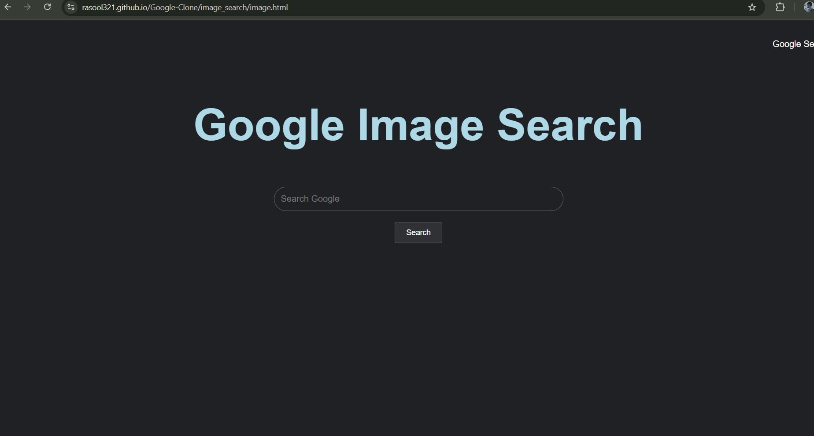
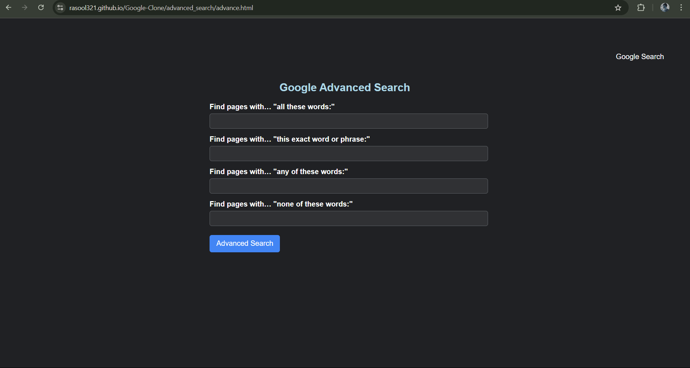

# 🌍 Google Clone

A sleek and minimalistic clone of Google Search, Image Search, and Advanced Search, built using **HTML & CSS**.

## 📌 Table of Contents
- [🔍 Overview](#-overview)
- [✨ Features](#-features)
- [🛠 Technologies Used](#-technologies-used)
- [🚀 Setup Instructions](#-setup-instructions)
- [📖 Usage](#-usage)
- [📁 Folder Structure](#-folder-structure)
- [📸 Screenshots](#-screenshots)
- [💡 Future Enhancements](#-future-enhancements)
- [🤝 Contributing](#-contributing)
- [📜 License](#-license)

## 🔍 Overview
This project is a simple yet **visually appealing clone** of Google's search functionality. It includes basic search, **Image Search**, and **Advanced Search**, allowing users to perform searches directly using Google's search engine.

## ✨ Features
✔️ Google-like Search UI  
✔️ Image Search Functionality  
✔️ Advanced Search Options  
✔️ Responsive & Clean Design  
✔️ Hover Effects for Better UX  
✔️ Lightweight & Fast Performance  

## 🛠 Technologies Used
- **HTML** 🏗️ (Structure)
- **CSS** 🎨 (Styling)

## 🚀 Setup Instructions
1. **Clone the repository**
   ```sh
   git clone https://github.com/rasool321/Google-Clone.git
   ```
2. **Navigate to the project folder**
   ```sh
   cd Google-Clone
   ```
3. **Open `index.html` in your browser** and start searching!

## 📖 Usage
💻 **How to use the Google Clone?**
- Open `index.html` to access the **Google Search Clone**.
- Click on **Image Search** for **image-based searches**.
- Click on **Advanced Search** for **refined query options**.

## 📁 Folder Structure
```
Google-Clone/
│-- images/
│   ├── homepage.png
│   ├── image_search.png
│   ├── advanced_search.png
│-- index.html
│-- styles.css
│-- image_search/
│   ├── image.html
│   ├── style1.css
│-- advanced_search/
│   ├── advance.html
│   ├── styles2.css
```

## 📸 Screenshots
Take a look at the UI! 👀

### 🏠 Home Page


### 🖼️ Image Search Page


### ⚙️ Advanced Search Page


## 💡 Future Enhancements
🔹 **Enhance UI** to match the latest Google design trends.  
🔹 **Add JavaScript** to improve interactivity.  
🔹 **Implement Dark Mode** for better UX.  
🔹 **Backend Support** to store search history.  

## 🤝 Contributing
🚀 Contributions are welcome! If you’d like to improve this project, feel free to **fork the repo**, make changes, and **submit a pull request**.  

## 📜 License
📄 This project is open-source and available under the [MIT License](LICENSE).
